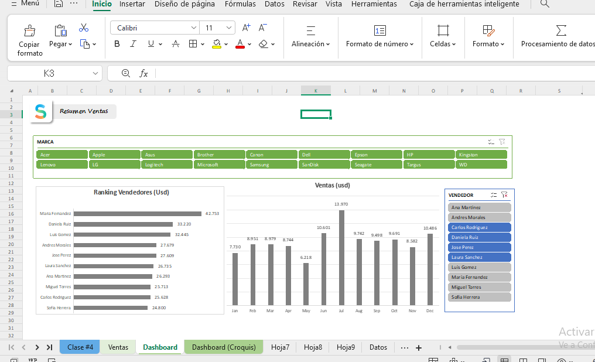

# Portafolio Administrativo | Raiza Hernández

## 📊 Proyecto Destacado: Dashboard de Gestión y Análisis

Este panel de control permite la visualización de datos de ventas mediante el uso de tablas dinámicas, segmentadores de datos y gráficos avanzados, facilitando la toma de decisiones administrativas.

### Competencias demostradas en este proyecto:

* **Análisis de Datos:** Procesamiento de bases de datos para informes mensuales.
* **Microsoft Excel Avanzado:** Uso de segmentadores (Slicers) para informes interactivos.
* **Visualización:** Creación de cuadros de mando ejecutivos claros y profesionales.
